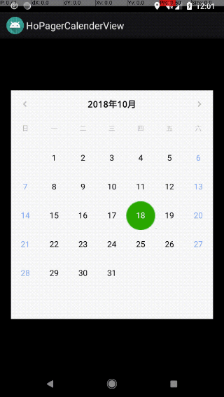

# HoPagerCalendarView

Author : hosle
Created in 24th Oct 2018

## Demo


## Usage

### 1.1. 添加日历视图到布局文件

activity_main.xml

```
<RelativeLayout xmlns:android="http://schemas.android.com/apk/res/android"
    android:layout_width="match_parent"
    android:layout_height="match_parent"
    android:paddingTop="20dp"
    android:background="#000000"
    android:orientation="vertical">

    <com.hosle.calendar.pagercalendar.PagerCalendarView
        android:id="@+id/view_calendar"
        android:layout_width="match_parent"
        android:layout_marginStart="20dp"
        android:layout_marginEnd="20dp"
        android:layout_centerVertical="true"
        android:layout_height="420dp" />

</RelativeLayout>

```


### 1.2. 设置日历参数

```

    /**
     * @param monthArrange month period to be shown
     * @param onDayClickListener click listener on day
     * @param operationForTaskCount check task count for each day
     * @param taskBitmap specific drawable bitmap for the day with task
     */

    fun fun setCalendarParams(monthArrange: Array<Array<Int>>, onDayClickListener: MonthView.OnDayClickListener?,
                          operationForTaskCount: ((Calendar) -> Int)? = null, taskBitmap: Bitmap? = null ) {
    }

```


## Extension

[HoVerticalCalendarView](https://github.com/hosle/HoVerticalCalendarView)

 A vertical list calendar view


## License

Copyright (C) 2018. Henry Tam (hosle)

Contact: hosle@163.com

Licensed under the Apache License, Version 2.0 (the "License"); you may not use this file except in compliance with the License. You may obtain a copy of the License at

http://www.apache.org/licenses/LICENSE-2.0

Unless required by applicable law or agreed to in writing, software distributed under the License is distributed on an "AS IS" BASIS, WITHOUT WARRANTIES OR CONDITIONS OF ANY KIND, either express or implied. See the License for the specific language governing permissions and limitations under the License.
